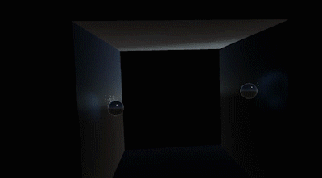

# Volumetric Fluid in Unity

Fun with volumetric fluid in Unity. This is just the core fluid solver, without any input bindings.
Open the Main scene, press play, and move around RightImpulser or LeftImpulser to see the action.

